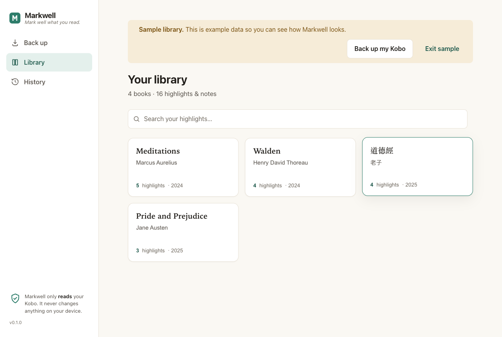
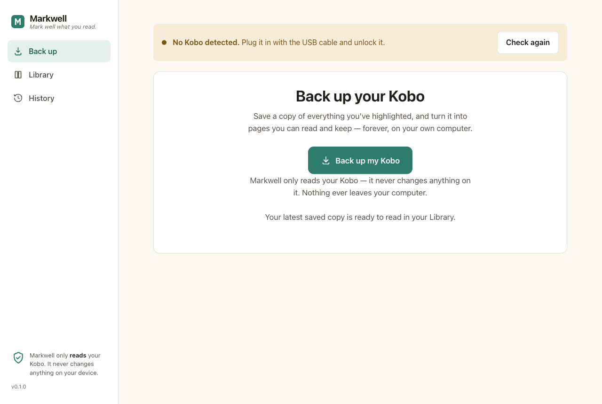
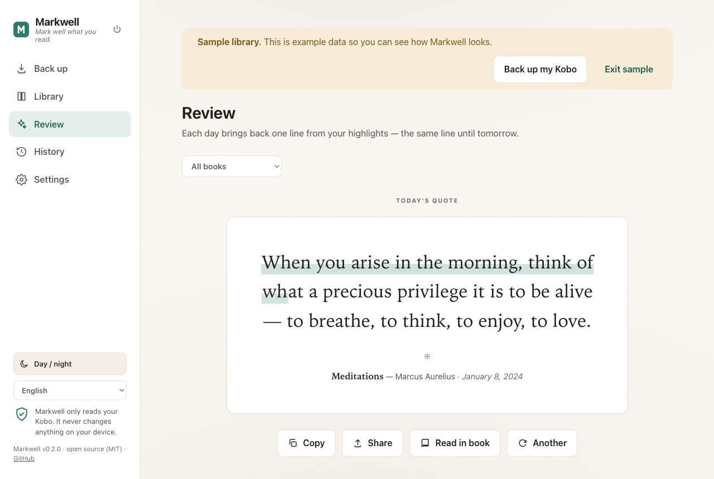
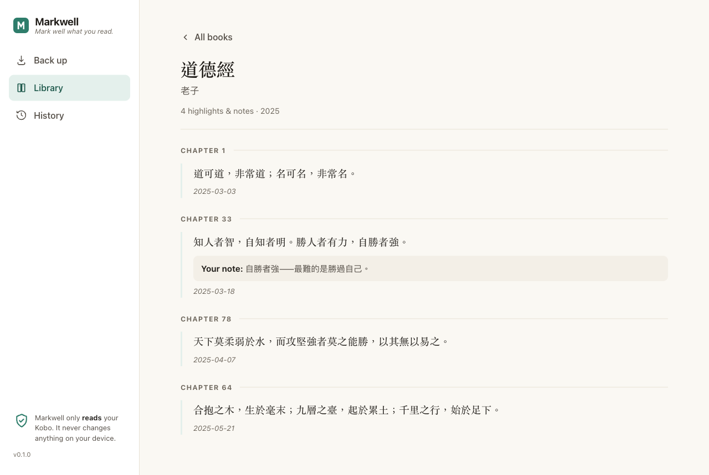

# Markwell

[English](README.md) · [中文（台灣）](README.zh-TW.md) · [日本語](README.ja.md) · **한국어**

> *읽은 문장을 오래 간직하세요.* Kobo 하이라이트를 백업하고 내보내, 온전히 나만의 기록으로 남기세요.

[](https://markwell.page)
[](https://github.com/ceparadise168/markwell/actions/workflows/ci.yml)
[](https://github.com/ceparadise168/markwell/releases)
[](https://pypi.org/project/markwell/)
[](https://pypistats.org/packages/markwell)

[Kobo](https://www.kobo.com/) 하이라이트와 메모를 안전하게 백업하고, 읽고,
내보낼 수 있습니다. 브라우저에서 바로 읽는 페이지와 함께 Markdown, JSON,
CSV, Anki 플래시카드, 인쇄할 수 있는 HTML 서재까지. 모든 것이 내 컴퓨터
안에서만 이루어집니다. 계정도, 클라우드 서비스도, 네트워크 연결도 없습니다.
크로스 플랫폼이며 의존성이 전혀 없습니다(Python 표준 라이브러리만 사용).



## Markwell 받기

[최신 릴리스](https://github.com/ceparadise168/markwell/releases/latest)에서
컴퓨터에 맞는 앱을 내려받으세요.

- **macOS** — [`Markwell-macOS.zip`](https://github.com/ceparadise168/markwell/releases/latest/download/Markwell-macOS.zip)
- **Windows** — [`Markwell-Windows.zip`](https://github.com/ceparadise168/markwell/releases/latest/download/Markwell-Windows.zip)

압축을 풀고 앱을 열면 Markwell이 브라우저에서 열립니다. 모든 동작은 내
컴퓨터 안에서만 일어납니다.

<details>
<summary><strong>처음 열 때 컴퓨터가 머뭇거린다면</strong> — 서명되지 않은 다운로드입니다</summary>

Markwell은 자유 소프트웨어이고, 다운로드에는 코드 서명 인증서가 없습니다.
그래서 처음 실행할 때 운영체제가 한 번 더 확인을 요청합니다.

- **macOS(Sonoma / macOS 14 이전)** — **Markwell**을 마우스 오른쪽 버튼으로
  클릭(또는 Control 키를 누른 채 클릭)하고 **열기**를 선택한 다음, 대화
  상자에서 다시 **열기**를 클릭하세요. macOS가 선택을 기억하므로 처음 한 번만
  하면 됩니다.
- **macOS(Sequoia / macOS 15 이후)** — 오른쪽 클릭 방법이 사라졌습니다.
  **Markwell**을 한 번 열고(차단됩니다), **시스템 설정 → 개인정보 보호 및
  보안**에서 **그래도 열기**를 클릭하세요.
- **Windows** — SmartScreen 창이 나타나면 **추가 정보**를 클릭한 뒤
  **실행**을 클릭하세요.

서명되지 않은 실행 파일이 꺼려진다면 아래의 Python 패키지로 설치하세요.
같은 앱이며, 동봉된 실행 파일이 없습니다.

</details>

명령줄이 더 편하다면, Markwell은 Python 패키지이기도 합니다(Python 3.9
이상).

```bash
pipx install markwell    # 또는: pip install markwell
markwell                 # 명령줄 도구
markwell-gui             # 데스크톱 다운로드와 같은 앱
```

### 제거하기

마음에 들지 않으면 언제든 지울 수 있습니다. Markwell은 백그라운드에 아무것도
설치하지 않습니다. 상주 서비스도, 계정도, 레지스트리 기록도, 네트워크 연결도
전혀 없습니다.

- **macOS / Windows** — (압축을 푼) **Markwell** 앱을 휴지통으로 옮기기만 하면
  됩니다. 남는 것은 아무것도 없습니다.
- **Python 패키지** — `pipx uninstall markwell`(또는 `pip uninstall markwell`).

서재와 저장 사본은 별도의 폴더(기본값 `~/Markwell`, **설정**에서 확인 가능)에
있으므로 제거해도 건드리지 않습니다. 말끔히 지우고 싶다면 그 폴더와 설정이
담긴 `~/.markwell/` 폴더도 함께 삭제하세요. 둘 다 온전히 내가 관리하는 평범한
폴더입니다.

## 왜 Markwell인가

하이라이트와 메모는 독서에서 무엇과도 바꿀 수 없는 부분입니다. Markwell은:

- **기기에 절대 쓰지 않습니다.** Kobo 데이터베이스를 *읽기만* 하고, 파일을
  로컬 저장 사본으로 복사합니다. SQLite의 내부 정리 작업조차 기기를
  건드리지 않습니다.
- **모든 저장 사본을 변하지 않는 기록으로 보관합니다.** 실행할 때마다
  타임스탬프가 붙은 `KoboReader-<stamp>.sqlite`를 저장하고 절대 덮어쓰지
  않으므로, 독서 데이터베이스의 완전한 역사가 쌓입니다.
- **가지고 다닐 수 있는 결과물을 만듭니다.** 읽기 좋은 Markdown, 문서화된
  JSON, 스프레드시트용 CSV, Anki 플래시카드, 파일 하나로 완결되는 HTML
  서재 — Obsidian, Anki, Excel, Readwise, 또는 직접 만든 스크립트에 넣을 수
  있습니다.

내보내기는 언제나 **최신** 저장 사본만 비춥니다. 하나의 데이터베이스를 새로
투영한 것이지, 쌓여 가는 아카이브가 아닙니다. 기기에서 하이라이트를 지우면
다음 내보내기에서는 사라집니다. 되찾으려면 날짜가 붙은 저장 사본에서 다시
내보내면 됩니다.

```bash
markwell --db backups/KoboReader-<stamp>.sqlite
```

## 앱(터미널 없이)

위의 데스크톱 다운로드를 열면 바로 이 앱입니다. 터미널에서는 다음과 같이
실행합니다.

```bash
markwell-gui          # 또는:  python3 -m markwell.gui
```

브라우저에서 열리고, 쉬운 말로 다음을 할 수 있습니다.

- **백업** — 버튼 하나로 Kobo의 사본을 만들고 하이라이트를 읽을 수 있는
  페이지로 바꿉니다. 진행 상황이 실시간으로 보이고 결과가 분명하게
  표시됩니다.
- **서재** — 차분하고 책 같은 화면에서 하이라이트와 메모를 읽고
  검색합니다(책마다 파일 하나, 읽은 순서대로, 메모와 함께).
- **복습** — 매일 내 하이라이트에서 한 구절이 돌아옵니다. 다른 구절로
  바꾸거나 책별로 골라 볼 수 있습니다.
- **기록** — 모든 저장 사본을 살펴보고, 옛 사본에서 파일을 다시 만들고,
  모든 것이 담긴 폴더를 엽니다.
- **설정** — 서재를 둘 곳을 고릅니다(원한다면 클라우드 폴더에). 모든
  데이터를 ZIP 아카이브 하나로 묶을 수도 있습니다.



명령줄과 같은 안전한 코어를 쓰므로 **Kobo에 절대 쓰지 않습니다**. 앱은
완전히 로컬로 동작합니다. `127.0.0.1`에만 서비스하고, 네트워크 연결을 전혀
만들지 않으며, 모든 요청에 실행할 때마다 새로 만들어지는 토큰을
요구합니다([`SECURITY.md`](SECURITY.md) 참고). 파일은 기본적으로
`~/Markwell`에 저장됩니다. **설정**에서 옮기거나 `--data-dir`로 지정할 수
있고, 앱은 파일 위치를 항상 보여 줍니다. 필요한 것은 Python 표준
라이브러리뿐 — 추가 의존성도, 빌드 단계도 없습니다.

## 복습과 공유 카드

**복습**은 매일 내 하이라이트에서 한 구절을 데려옵니다. 오늘은 이 구절
그대로, 내일은 새로운 구절로. 더 보고 싶으면 다른 구절로 바꿀 수 있고,
책별로 고를 수도 있습니다. 그리고 어떤 하이라이트든 **공유 카드**로 만들 수
있습니다. 세 가지 크기와 세 가지 스타일, 한중일 문자를 배려한 타이포그래피,
켜고 끌 수 있는 워터마크. 카드는 로컬 캔버스에서 그려지며, 아무것도 컴퓨터
밖으로 나가지 않습니다.





## 내 데이터, 내 언어로

인터페이스 전체가 **English, 繁體中文, 日本語, 한국어**를 말합니다.
사이드바에서 바꿀 수 있고 선택은 기억됩니다. 내보내기도 현지화됩니다.
Markdown과 HTML 파일의 골격 — 제목, 개수, 표 머리글 — 이 내 언어로
적힙니다. 앱은 인터페이스 언어를 자동으로 전달하고, 명령줄에서는
`--lang en|zh-TW|ja|ko`로 지정합니다. 하이라이트와 메모 자체는 언제나 원문
그대로이며, 절대 번역되지 않습니다.

CSV와 Anki의 열 이름(그리고 JSON 키)은 일부러 영어로 둡니다. 기계가 읽는
식별자라서 Notion이나 Anki 같은 도구가 이 이름으로 필드를 맞추기 때문에,
번역하면 모든 가져오기 절차가 깨집니다.

## 내 클라우드에 백업

Markwell이 저장하는 모든 것은 평범한 폴더 하나에 담겨 있습니다. **설정**을
열고 iCloud Drive, Google 드라이브, Dropbox, OneDrive 중 하나를 고르면
Markwell이 서재를 그곳으로 복사합니다. 아무것도 삭제되지 않고, Markwell
스스로는 단 1바이트도 업로드하지 않습니다. 동기화는 내 클라우드 앱이 여느
폴더처럼 처리할 뿐입니다. 같은 화면에서 모든 것을 ZIP 아카이브 하나로 묶을
수도 있습니다. 새 컴퓨터로 옮기는 방법을 포함한 단계별 안내는
[클라우드 백업 가이드](docs/cloud-backup.ko.md)에 있습니다.

## 명령줄

Kobo를 연결한 다음 실행하세요.

```bash
markwell                 # 기기 사본을 만든 뒤 모든 형식으로 내보내기
markwell --format md     # 형식 하나: md, json, csv, anki, html
markwell --format md,csv # 쉼표로 여러 형식 지정("all" = 모든 형식)
markwell --lang ko       # 내보내기 라벨 언어: en, zh-TW, ja, ko
markwell --snapshot-only # 데이터베이스 백업만, 내보내기는 하지 않음
markwell --db PATH       # 기존 저장 사본에서 내보내기(기기를 읽지 않음)
markwell --device PATH   # Kobo 마운트 지점 또는 KoboReader.sqlite 경로(자동 감지보다 우선)
markwell --require-device # 기기가 없을 때 최신 로컬 사본으로 대체하지 않고 실패
markwell --out DIR       # 출력 디렉터리(기본: output/, 현재 디렉터리 기준)
markwell --debug         # 오류 시 전체 트레이스백 표시
markwell --version       # 버전을 표시하고 종료
```

진행과 상태 메시지는 **stderr**로 나가고, 내보낸 데이터와 JSON은 `--out`
아래 파일로 저장됩니다. 성공하면 출력 디렉터리의 절대 경로를 출력하므로,
파일이 어디에 놓였는지 항상 알 수 있습니다.

출력(`backups/`와 `output/`은 현재 디렉터리 기준으로 만들어집니다):

```
backups/
└── KoboReader-YYYYMMDD-HHMMSS.sqlite   타임스탬프 포함, 절대 덮어쓰지 않음
output/
├── index.md            모든 책, 개수, 링크
├── <book>.md           책마다 파일 하나, 하이라이트는 읽은 순서대로
├── highlights.json     기계 판독용 내보내기(schema "markwell/1")
├── highlights.csv      하이라이트마다 한 행, Excel / Numbers / Notion용
├── anki.tsv            Anki로 바로 가져올 수 있는 플래시카드
└── library.html        서재 전체를 하나의 완결된 페이지로
```

## 동작 방식

`기기 감지 → 한 번만 사본 저장(읽기 전용) → 사본 읽기 → 선택한 형식으로 출력`

기기는 한 번의 실행에서 많아야 한 번 읽히고, 절대 수정되지 않습니다.
내보내기는 최신 사본의 투영일 뿐입니다. 모든 것을 지키는 것은 **사본의
역사**입니다. 기기에서 지운 하이라이트도, 그것이 마지막으로 담겼던 날짜
붙은 `.sqlite`에서 되찾을 수 있습니다([왜 Markwell인가](#왜-markwell인가)
참고).

## JSON 형식(개발자용)

`highlights.json`은 버전이 약속된 기계 판독용 내보내기입니다. schema는
`markwell/1`이며, 같은 메이저 버전 안에서는 필드가 추가만 될 뿐 기존 필드는
깨지지 않습니다(읽는 쪽은 모르는 필드를 무시해야 합니다). 필드 정의와
호환성 규칙은 개발자 계약이며, 영어 문서가 기준입니다. 영어판
[JSON format](README.md#json-format)을 참고하세요.

### 종료 코드

| 코드 | 의미 |
|--:|---|
| `0` | 성공 |
| `2` | 기기가 없고, 사용할 수 있는 사본/소스도 없음 |
| `3` | 데이터베이스는 읽었지만 하이라이트나 메모가 없음 |
| `4` | 소스를 읽을 수 없거나 지원하지 않는 스키마 |

## 참고 및 호환성

- `Bookmark`와 `content` 테이블이 있는 Kobo 펌웨어 스키마에서 테스트했습니다.
  펌웨어 업데이트로 스키마가 바뀌면 이슈를 열어 주세요.
- 메모(주석)는 `Bookmark.Annotation`에서 읽습니다. 하이라이트에 메모를 써
  두었다면 각 하이라이트 아래에 나타납니다.
- **내보낸 텍스트는 원문 그대로이며, 신뢰할 수 없는 데이터로 다루세요.**
  하이라이트와 메모는 쓰인 그대로 재현됩니다. Markdown/JSON은 *데이터*이지
  신뢰할 수 있는 마크업이 아닙니다. `=`, `+`, `-`, `@`로 시작하는 값은
  스프레드시트/CSV로 가져올 때 수식으로 해석될 수 있으니, 중요하다면 가져올
  때 정리하세요. [SECURITY.md](SECURITY.md)를 참고하세요.

## 개발

```bash
pip install -e ".[dev]"
pytest
```

아키텍처 불변 조건과 프로젝트 규칙은 [CONTRIBUTING.md](CONTRIBUTING.md),
변경 내역은 [CHANGELOG.md](CHANGELOG.md), 보안 취약점 신고 방법은
[SECURITY.md](SECURITY.md)를 보세요(이 개발자 문서들은 영어로 제공됩니다).

## 메인테이너

Eric Tu([@ceparadise168](https://github.com/ceparadise168))가 만들고
관리합니다 — hi@markwell.page. Markwell은 무료이자 오픈소스이며, 앞으로도 계속
무료입니다. 당신의 독서를 간직하는 데 도움이 되었다면, 리포지터리에 별을
남기거나, 인용 카드를 공유하거나, [커피 한 잔 ☕](https://ko-fi.com/erictu) 사주세요.

## 감사의 말

Markwell이 존재할 수 있는 것은 **Kobo** 덕분입니다. 하이라이트를 USB로 기기에서
바로 읽을 수 있는 표준 SQLite 데이터베이스라는 열린 형식으로 저장하고, 독자와
개발자 모두에게 친화적인 태도를 취합니다. Kobo와
[@kobolabs](https://github.com/kobolabs)에 감사드립니다.

## 라이선스

MIT — [LICENSE](LICENSE)를 참고하세요.
